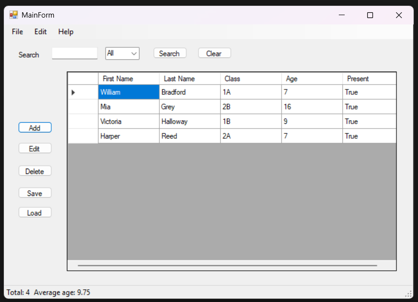
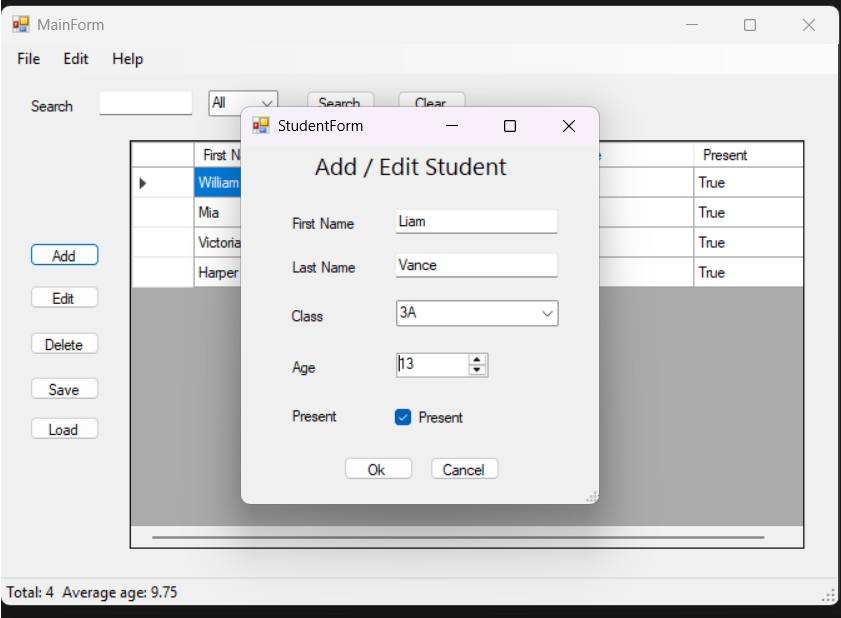

# StudentManager — Desktop Student Management App

A simple Windows Forms (WinForms) application for managing students.  
Built for educational purposes (INF.04 / technical school project in Poland).  

---

## Features

- Add, edit, and delete students
- List students in a DataGridView
- Search by first name or last name
- Filter by class/grade
- Track if a student is Present/Absent
- Sort students by last name
- Save and load students to/from a TXT file
- Display total students and average age in a StatusStrip

---

## Controls

**MainForm**:

- `DataGridView` → `dgvStudents`  
- `TextBox` → `txtSearch`  
- `ComboBox` → `cmbFilterClass`  
- Buttons: `btnAdd`, `btnEdit`, `btnDelete`, `btnSave`, `btnLoad`, `btnSearch`, `btnClear`  
- Labels: `lblTotal`, `lblAverageAge`  

**StudentForm**:

- `TextBox` → `textBoxFirstName`, `textBoxLastName`  
- `ComboBox` → `comboBoxCLass`  
- `NumericUpDown` → `nudAge`  
- `CheckBox` → `cbPresent`  
- Buttons → `btnOk`, `btnCancel`  

---

## How to Run

1. Open the solution in **Visual Studio 2022** or later  
2. Make sure the target framework is **.NET 6.0**  
3. Build and run the project  
4. The application will create a `students.txt` file in the startup folder for saving/loading data  

---

## Screenshots

Place screenshots of your app here to show functionality:

  
  

> You can create a `screenshots` folder in your project and add images there.  

---

## Notes

- Age must be between **6 and 21**  
- Duplicate students (same first + last name) are not allowed  
- The application is lightweight and suitable for learning purposes