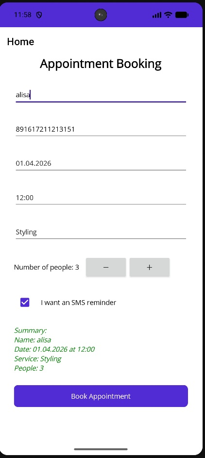
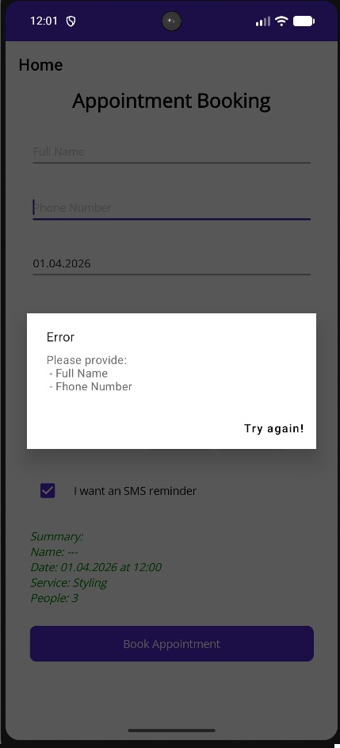
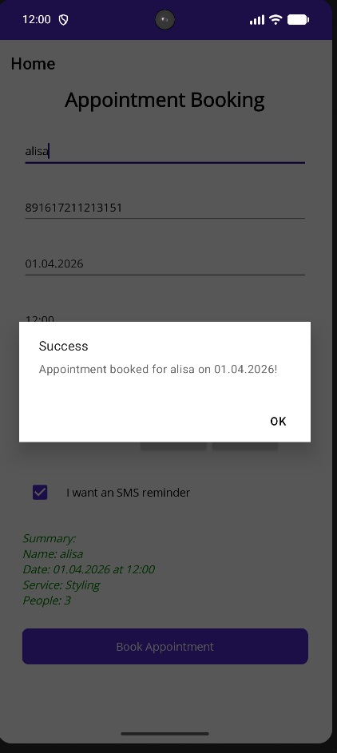

# ✂️ Barber Booking App (.NET MAUI)

A modern mobile application for booking hair appointments, built with **.NET MAUI**. This project demonstrates event handling, real-time UI updates, and data validation in a cross-platform environment.

## ✨ Features
* **Real-time Summary:** The booking details update instantly as you type or change selections.
* **Interactive UI:** Includes DatePicker, TimePicker, Stepper, and Picker controls.
* **Dynamic Styling:** Summary text turns **green** when the SMS reminder option is toggled on.
* **Validation:** Built-in checks to ensure Name and Phone Number are provided before confirming.

## 📸 Screenshots

<table style="width: 100%; border: none;">
  <tr>
    <td align="center" style="border: none;">
       
      <i>Main Form</i>
    </td>
    <td align="center" style="border: none;">
       
      <i>Error Dialog</i>
    </td>
    <td align="center" style="border: none;">
       
      <i>Success Dialog</i>
    </td>    
  </tr>
</table>

## 🛠 Tech Stack
* **Framework:** .NET MAUI (C# / XAML)
* **Concepts:** Event Handling (`TextChanged`, `DateSelected`, `PropertyChanged`), Async/Await, Input Validation.

## 🚀 How to Run
1. Clone the repository.
2. Open the solution in **Visual Studio 2022**.
3. Ensure the **.NET MAUI workload** is installed.
4. Press `F5` to run on Android, iOS, or Windows.
