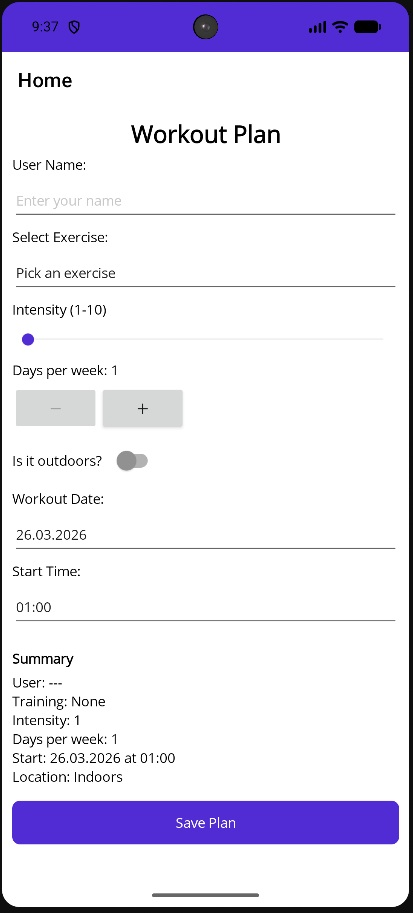
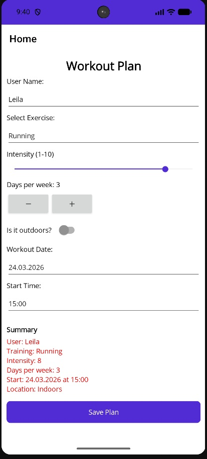
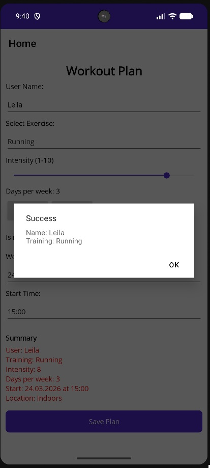
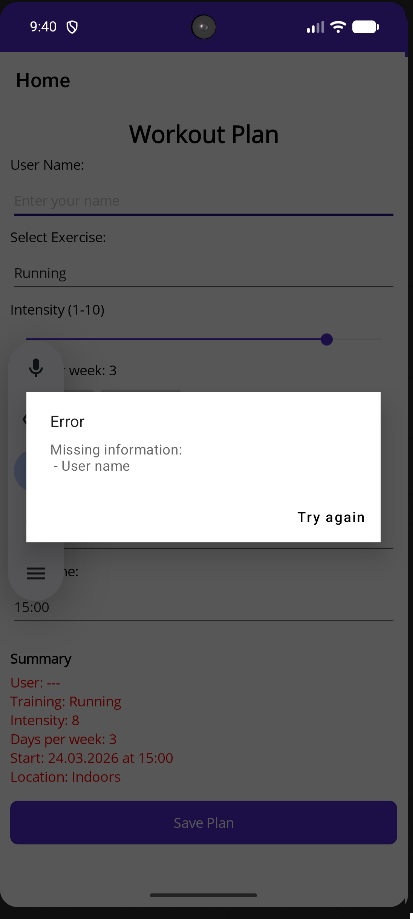

# FitLog - Workout Planner

A lightweight **.NET MAUI** mobile application designed to help users create and visualize their daily workout routines.

## ✨ Features
* **Custom Plan Input:** Enter name, exercise type, and intensity.
* **Smart Scheduling:** Select specific days, dates, and times using native pickers.
* **Real-time Summary:** See your plan update instantly as you change values.
* **Dynamic UI:** Text color changes based on workout intensity (Green/Orange/Red).
* **Validation:** Built-in checks to ensure all required fields are filled before saving.

## 🚀 Tech Stack
* **Framework:** .NET MAUI (Multi-platform App UI)
* **Language:** C# / XAML
* **Platform:** Android / iOS / Windows

## 📸 Preview
<table style="width:100%">
  <tr>
    <td></td>
    <td></td>
    <td></td>
    <td></td>
  </tr>
</table>

## 🛠️ How to Run
1. Clone the repository.
2. Open the `.sln` file in **Visual Studio 2022**.
3. Ensure the **.NET MAUI workload** is installed.
4. Select your target (Emulator or Framework) and press **F5**.